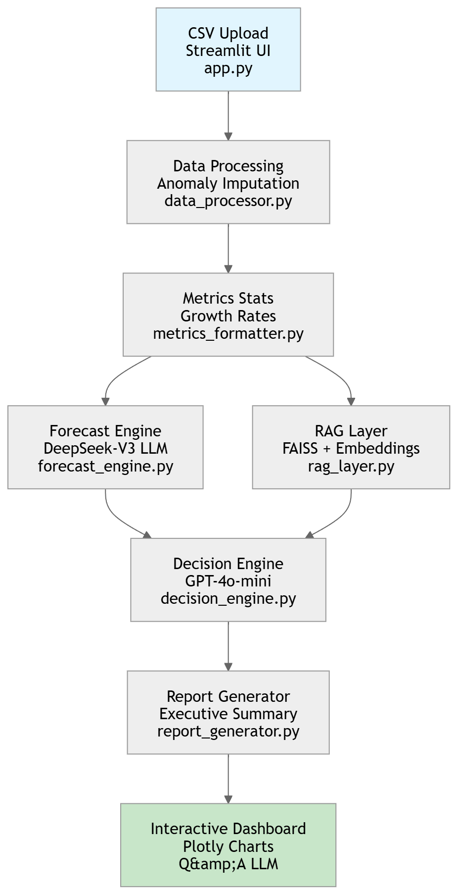

# AI Infrastructure Capacity Planning Advisor - Project Report


## 1. Purpose and Overview

The **AI Infrastructure Capacity Planning Advisor** is a dynamic, AI-powered web application designed to analyze infrastructure metrics from CSV files, perform multi-horizon forecasting, retrieve relevant scaling policies via RAG, and generate executive capacity recommendations. 

**Key Capabilities:**
- **Dynamic Metric Detection**: Automatically identifies numeric metrics (CPU%, memory, requests/sec, etc.) from any CSV without schema knowledge.
- **Anomaly-Robust Processing**: Imputes anomalies using adjacent values and statistical methods.
- **Multi-Metric Forecasting**: Projects resource utilization 7-30+ days ahead using LLM-driven trend analysis (linear/exponential).
- **RAG-Enhanced Decisions**: Retrieves AWS scaling policies and incident reports for context-aware recommendations.
- **Interactive Reporting**: Streamlit UI with Plotly visualizations, LLM Q&A, and executive summaries.

Built for SRE/CloudOps teams to proactively scale infrastructure before incidents occur.

## 1.1 System Architecture




## 2. Forecasting Component

The forecasting pipeline (`forecast_engine.py`) uses GenAI Lab's DeepSeek-V3 for dynamic multi-metric projection:

```
1. Input: Recent history, growth rates, capacities/thresholds from data_processor.py
2. RAG Context: Scaling policies from FAISS vectorstore (`rag_layer.py`)
3. LLM Prompt: Generate JSON forecasts for ALL detected metrics (`prompts.py`)
4. Fallback: Trend-based mock with exponential growth detection
5. Output: {'forecasts': {'cpu_usage_percent': 85.2, ...}, 'risk_level': 'HIGH', 'trend_summary': '...'}
```

**Example**: CPU 78% → 85% (7 days) triggers \"HIGH\" risk with 20% buffer recommendation.

## 3. RAG Component

**Retrieval-Augmented Generation** (`rag_layer.py`) provides enterprise knowledge:

```
- Vectorstore: FAISS with OpenAI text-embedding-3-large
- Documents: `sample_docs.json` (AWS policies, incident post-mortems)
- Query: \"scaling policies for CPU utilization trends\"
- Top-K: Returns 2 most relevant docs for decision prompts
```

**Status Check**: `has_metrics_docs()` confirms metric-specific content loaded.

## 4. Key Python Modules

| Module | Primary Function | Core Technologies |
|--------|------------------|-------------------|
| `app.py` | Streamlit UI, file upload, Plotly charts, Q&A | Streamlit, Plotly, Pandas |
| `data_processor.py` | CSV validation, anomaly imputation, stats computation | Pandas, NumPy |
| `forecast_engine.py` | LLM-driven multi-metric forecasting | OpenAI API, JSON prompts |
| `rag_layer.py` | FAISS vectorstore + similarity search | LangChain, FAISS, OpenAI Embeddings |
| `decision_engine.py` | LLM capacity recommendations | GPT-4o-mini, RAG context |
| `report_generator.py` | Executive PDF-ready reports | GPT-4o-mini templating |
| `prompts.py` | JSON-structured LLM prompts | String templates |
| `metrics_formatter.py` | LLM-friendly metric summaries | Dynamic string formatting |

## 5. LLM Prompt Usage

**Forecasting** (`get_forecast_prompt`): Instructs LLM to match ALL metric names exactly, apply trend modeling with RAG context.

**Decision Making** (`get_decision_prompt`): JSON response with prioritized actions, urgency scoring.

**Reporting** (`get_report_prompt`): Executive summary incorporating forecasts + decisions.

All prompts enforce **JSON-only responses** (`response_format={"type": "json_object"}`) for parsing reliability.

## 6. Recommendations & Best Practices

### ✅ **Production Deployment**
```
1. Upload enterprise docs to sample_docs.json (scaling policies, runbooks)
2. Configure CloudWatch → CSV export pipeline
3. Deploy to Streamlit Cloud/EC2 with .env secrets
4. Monitor GenAI Lab API quotas/costs
```

### 🚀 **Enhancements**
- **Multi-file RAG**: S3 doc sync for vectorstore
- **Alerting**: Slack/Teams integration for HIGH risk
- **Historical Baselines**: Trend analysis across CSV uploads
- **Multi-tenant**: Team-based metric namespaces

### 📊 **Metrics-Driven Success**
```
Success = Proactive scaling before P1 incidents
Target: Reduce reactive scaling events by 70%
ROI: Forecast accuracy >85% on historical backtests
```

---

*Generated: {date} | Version: Dynamic RAG POC v1.0*

